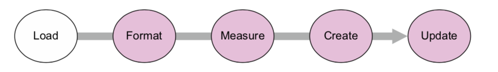

## Part 1: The Fundamentals
---
**D3.js** is a JavaScript library for manipulating documents based on data. D3 helps you bring data to life using HTML, SVG, and CSS

D3 provides developers with the ability to create rich interactive and animated content based on data and tie that content to existing web page elements. <br>
It gives you the tools to create high-performance data dashboards and sophisticated data visualization, and to dynamically update traditional web content.

However, It’s a much longer process than using dedicated charting libraries, but the D3 process is also its **strength**.

### Selecting and Binding
D3 is all about these two. *Selection* is the grouping of elements, whether graphics or traditional divs. <br>
<br>
*Selecting*
<br>
```javascript 
d3.selectAll("circle.a").style("fill", "red").attr("cx", 100);
```

This code takes every circle with class a and turns it red and moves it so that its center is 100 pixels to the right of the left side of our *svg* canvas.

Selections can be made by either `d3.select()` for one element, or `d3.selectAll()` for multiple elements.
<br>
<br>
*Binding*
<br>
<br>
```javascript
d3.selectAll("div.class1").data([4,5,61,3])
``` 
<br>

That line **binds** the array [4,5,61,3] to `div` elements with `class1`. A very **critical** thing to understand and remember here, is that those are rarely equal to each other in length. In some cases we have more divs than data points or vice versa.
<br>
<br>
### The DOM
A web page is structured according to the DOM. It defines a set of nested elements. <br>
Three categories of information about each **element** determine its behavior and appearance: *styles*, *attributes*, and *properties*. This how **D3** gets access to each one:

```javascript
d3.select("#someDiv").style("border", "5px darkgray dashed");
d3.select("#someDiv").attr("id", "newID");
d3.select("#someCheckbox").property("checked", true);
```

`html("content")` Gets or sets the inner HTML of selected element.

### SVG
SVG allows for simple mathematical representation of images. It provides options to draw different shapes such as Lines, Rectangles, Circles, Ellipses, etc. Hence, designing visualizations with SVG gives you more power and flexibility.

```html
<svg style="width:500px;height:500px;border:1px lightgray solid;">
</svg>
```
An `<svg>` element can be styled with CSS to have differ- ent borders and backgrounds. Or use D3 to style it! 

#### SVG: `<text>` element
svg allows for text as well as shapes. It's primarily used for **labels**.

#### SVG: `<g>` element
The `<g></g>` element doesn't exsit as a bounded space. Instead, it's used a logical grouping of elements. Let's say you want a number of shapes to be associated with each other or a shape and its label, you can place them inside a `<g>` element.

```html
<g>
<circle r="2"/>
<text>This circle’s Label</text>
</g>
```
##### transform(): An attribute of the `<g>` element
`transform` allows you to move the `<g>` element around your canvas. 
```html
<g transform="translate(100,50)">
```
The *transform* is pretty annoying because it accepts its description in the form of a text string. The line above moves the `<g>` element 100px to the right and 50px down. <br>
The `transform` attr also accepts a `scale()` so you can change the shape of the rendered shape. 
```html
<g transform="translate(100,400) scale(2.5)">
```

#### SVG: `<path>` 
`path` is the area determined by its `d` attribute. The area can be either **open** or **closed** depending on the presence of the letter `Z` at the end of the string in the `d` attribute. Area is closed if there's `Z`. <br>
```html
<path style="fill:none;stroke:gray;stroke-width:4px;"
     d="M 10,60 40,30 50,50 60,30 70,80" transform="translate(0,0)" />
```
And this one below is closed due to the presence of `Z`.
```html
<path style="fill:none;stroke:gray;stroke-width:4px;"
     d="M 10,60 40,30 50,50 60,30 70,80Z" transform="translate(0,200)" />
```

### Some CSS
We have showed how you can overwrite an entire class name by using `attr()`. But often a class is composed of multiple strings. We can edit those using `classed()`. It allows you to **append** or **remove** a class. <br>
```javascript
d3.select("circle").classed("active", true);
```
This line appends a class "active" to the `circle` element.

#### `.data()` 
You use the function `.data()` to bind **each** element in your selection (`.select()`) to each element in your array. If you have more items in your array than elements on your page, you use `.enter()`. When you have less items in your array than your selection that's when you use `.exit()`. 

#### `transition()` & `delay()`
`transition` method indicates that you don’t want your change to be instantaneous. By chaining it with the `.delay()` method, you indicate how many milliseconds to wait before implementing the style or attribute changes that appear in the chain after that.
```javascript
d3.selectAll("circle").transition().delay(2000).attr("cy", 200);
```
Or you can also chain `transition` to `duration()` telling your browser how much time (in milliseconds) you want your changes to take effect.


### Working with D3


D3 has five functions for loading data: `d3.text(), d3.xml(), d3.csv(), d3.json() and d3.html()`. <br>
Both d3.csv() and d3.json() both have the same format: you declare a **path** and a callback function.
```javascript
d3.csv("data/cities.csv",function(error,data) {console.log(error,data)});
```
The error variable is optional.
```javascript
d3.json("data/tweets.json",function(data) {console.log(data)});
```
Both `d3.csv` and `d3.json` are asynchronous, and will return after the request to open the file and not after processing the file. **if you call functions that require the data, they will fail!** <br>
<br>
Also, remember when you load the data, it will often be in a string format regardless of its previous data type.

#### `d3.scale()`
We use `.scale()` to normalize our data. `d3.scale.linear()` makes a direct relationship between your actual data and a new range of values. This done by setting a **domain** and a **range** which accepts arrays. <br>
`d3.time.scale()` provides a linear scale that’s designed to deal with date datatypes. There are less known scalers such as `d3.scale.log() d3.scale.pow(), d3.scale.ordinal` among others.


#### `d3.scale.quantile()`
Splits the data array into equal 'bins'. The number of parts and their labels are determined by the `.range()`. You will simply need to pass in your data through `.domain()` and it will sort it then splits according to `.range()`
```javascript
d3.scale.quantile().domain(sampleArray).range([0,1,2]);
```

#### `d3.min()`
```javascript
d3.min(data, function (el) {return +el.population});
```
Returns the minimum value in the data. In this case we passed the cities object and it returned the min value in population.
#### `d3.max()`
```javascript
d3.max(data, function (el) {return +el.population});
```
Returns the maximum value in the same data.

#### `d3.extent()`
Returns both min and max values in the form of an array.
```javascript
d3.extent(data, function (el) {return +el.population});
```
#### Notes on Selections
We select one or more elements of the page. `.select()` for one and `selectAll()` for all similar elements. Often the selected element doesn't exist, this is called *empty selection*. We use `.enter()` to create the **new** element in the page. We can chain these two but note that a subselection **won't** create a parent element. You will need to create one using `.append()`!

#### `.data()`
This is where you associate each element in your selection to one item of your data.
<br>
You need to use `.enter()` if your data have more items than the elements selected and `.exit()` if it's less. Neither needs to be called if the two are equal.

#### `.html()`
Sets the content of your selected html.